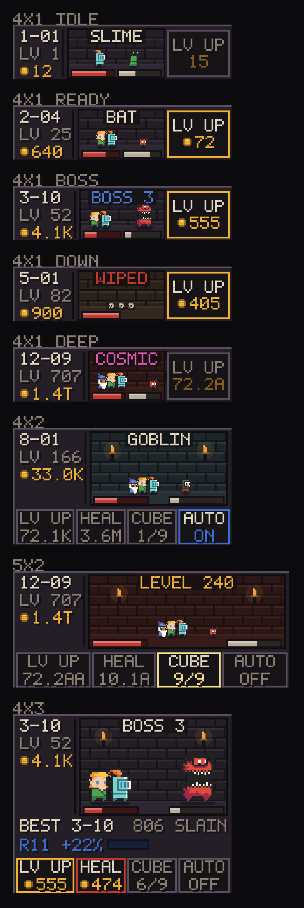
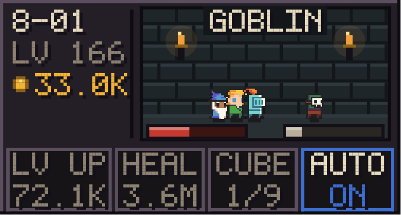
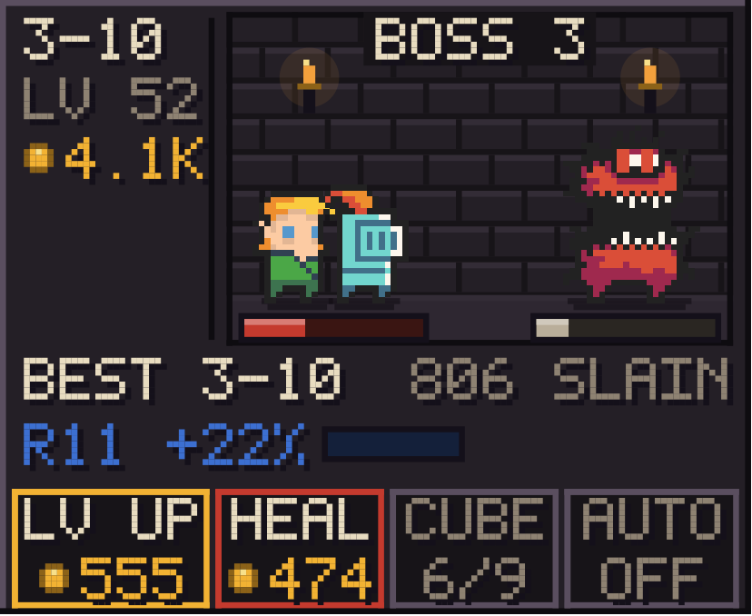
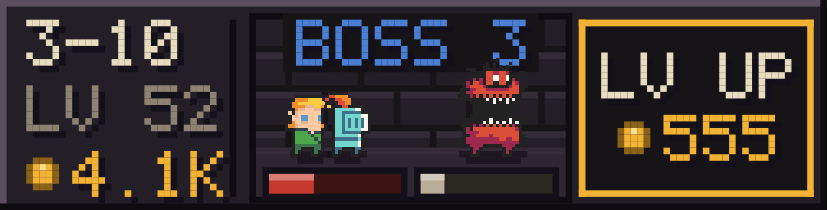
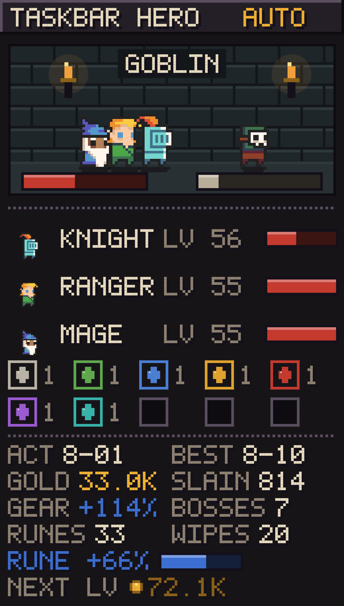
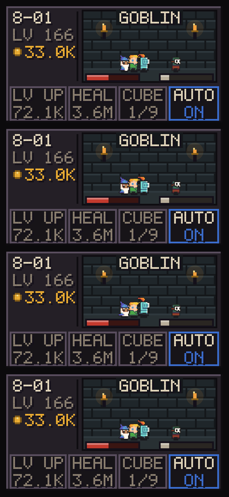

# Taskbar Hero — widget Nothing Phone

Un **idle-RPG en barre**, inspiré de [*TBH: Task Bar Hero*](https://store.steampowered.com/app/3678970/TBH_Task_Bar_Hero/)
(Nugem Studio) — le jeu qui tient dans une fenêtre minuscule dockée à la barre des
tâches Windows. Ici cette fenêtre devient un **widget d'écran d'accueil de Nothing
Phone** : une salle de donjon en pixel art où un groupe de héros enchaîne les
vagues tout seul, même écran éteint — avec ses boutons sur l'écran d'accueil, et
le jeu complet à un appui.

> Projet hommage, sans affiliation avec Nugem Studio ni Nothing Technology.



## Ce que ça fait

**En 4×2 — la taille par défaut — le widget est le jeu.** La salle occupe le haut,
et quatre vrais boutons occupent le bas :



| Bouton | Effet | Allumé quand |
| --- | --- | --- |
| **LV UP** | monte le héros le plus en retard, pour que le groupe progresse d'un bloc | l'or suffit (cerclé d'or) |
| **HEAL** | potion : soigne tout le groupe, et le relève immédiatement après un wipe | l'or suffit *et* il y a quelque chose à soigner (cerclé de rouge) |
| **CUBE** | le Hero-dric Cube : neuf objets d'un grade en donnent un du grade au-dessus | une pile atteint 9 (cerclé de la couleur du grade à venir) |
| **AUTO** | le moteur dépense l'or tout seul | activé (cerclé de bleu) |

Le bouton CUBE affiche `6/9` avant d'être prêt : il explique ce qu'il attend au
lieu de rester muet.

Un appui **n'importe où ailleurs** — la salle, la colonne de gauche — ouvre le jeu
complet : mêmes sprites en ×4, toutes les stats, et le journal de combat coloré.

La colonne de gauche garde en permanence les trois nombres qu'on surveille :
acte-vague, niveau, or. À partir de 4×3, deux lignes d'info s'ajoutent (record,
morts au compteur, barre de runes) — pas avant, parce qu'en 4×2 la place vaut
mieux dépensée en combattants qu'en chiffres déjà affichés ailleurs.

- Toutes les 10 vagues, un boss ; le tuer fait vibrer le téléphone et lâche un
  butin dont **la couleur dit le grade** (les 10 grades de TBH, de Common à
  Cosmic). Si le groupe tombe, il repart au début de l'acte — or, niveaux et
  butin restent acquis, et une potion le relève sur-le-champ.
- **Réduit en 4×1**, le widget retombe sur une bande : la salle et un seul bouton
  LV UP sur la droite. Agrandi en 4×3, les combattants passent à ×2.

<p align="center">
  
  
</p>

Deux tailles, deux dispositions, donc deux jeux de zones tactiles : le widget
publie une `RemoteViews` **par taille** (`OPTION_APPWIDGET_SIZES`, Android 12+) et
rend un bitmap à la dimension exacte de chacune. Sans cela le launcher étirerait
une image prévue pour une autre forme — et étirer du pixel art, c'est le flouter.
Le deck fait 48 dp de haut quelle que soit la taille du widget : une hauteur fixe
en dp est à la fois une cible tactile confortable et le seul moyen que le dessin
et les zones tombent exactement au même endroit.

## Les systèmes repris à TBH

Le jeu d'origine n'est pas un simple compteur qui monte, et le widget non plus.
Trois de ses mécaniques structurantes sont reprises telles quelles :

**Un groupe de trois héros, pas un.** Le chevalier ouvre la partie ; le rôdeur
rejoint à l'acte 2, le mage à l'acte 4. C'est la seule progression que l'or
n'achète pas. Chacun a sa courbe : le chevalier encaisse (1,7× de vie), le mage
frappe (1,45× de dégâts) et meurt d'un courant d'air. **Le monstre ne tape que le
héros de devant** — les autres régénèrent pendant ce temps, et un héros à zéro
sort du combat sans faire tomber le groupe. C'est le wipe complet qui fait
reculer.

**Les 10 grades de butin.** Chaque boss lâche un objet, d'un grade qui monte avec
l'acte — Common à l'acte 1, Cosmic à partir de l'acte 10. Le stash n'est pas
décoratif : chaque objet ajoute des dégâts, et un grade vaut 1,7× le précédent.

**Le Hero-dric Cube.** Neuf objets d'un grade en donnent un du grade supérieur —
la mécanique que le wiki documente mot pour mot. Il consomme toujours le grade le
plus bas qui peut fusionner, si bien que le stash grimpe par le bas comme il se
remplit. C'est ce qui rend une pile de communs intéressante au lieu d'être un
déchet.

<p align="center">
  
</p>

Le plein écran est là pour ça : la feuille de groupe (classe, niveau, vie de
chacun, et les recrues à venir avec leur acte d'arrivée) et la grille du stash,
une case bordée par grade avec ce qu'on en possède.

## Direction artistique

Celle du jeu d'origine, pas celle du téléphone : pierre chaude, lettres parchemin,
chiffres dorés, codes ARPG que personne n'a besoin qu'on lui explique.

- **Tout est un carré plein.** Aucune courbe anti-aliasée, aucun dégradé, aucun
  coin arrondi. Les panneaux sont biseautés à l'ancienne — arête claire en haut à
  gauche, sombre en bas à droite.
- **Police bitmap 5×7**, chaque pixel posé sur une ombre d'un pixel : c'est ce qui
  rend le parchemin lisible sur la maçonnerie.
- **Les combattants viennent d'un pack de sprites** — *16x16 DungeonTileset II*
  de [0x72](https://0x72.itch.io/dungeontileset-ii), CC0 — posé dans
  `app/src/main/assets/` avec un mapping texte qui dit quel rectangle est quel
  personnage. Rien n'y est obligatoire : chaque nom absent retombe sur l'art
  interne, sprite par sprite. Tout est dans [docs/ASSETS.md](docs/ASSETS.md).
- **Les combattants s'animent**, quatre images par personnage, choisies sur
  l'horloge et non sur un compteur : deux surfaces qui dessinent au même instant
  tombent sur la même image, et un widget redessiné à des moments qu'il ne
  choisit pas n'a rien à perdre. Le chevalier alterne garde et fente toutes les
  demi-secondes — même beat pour le pack et pour l'art interne, une seule
  fonction décide.



- **Sprites internes indexés par palette** (`'.'` transparent, `'1'..'9'` =
  couleurs propres au sprite), générés dans le code : c'est le filet, et ça reste
  diffable et testable. Chaque combattant porte son contour en index 1.
- **Échelles entières uniquement, et communes à tout le casting** : réduire un
  sprite de 32 à 21 px supprime des pixels source et donne cette bouillie
  caractéristique. Un seul facteur `boîte / plus grande frame` pour tout le monde,
  donc les tailles du pack *sont* les proportions à l'écran — l'ogre écrase le
  chevalier, le crâne d'un héros tombé reste une babiole par terre. C'est aussi
  pourquoi une barre plus **haute** montre de plus grands combattants, alors
  qu'une barre plus large montre une plus grande salle : la hauteur est ce qui
  décide si un cran d'échelle supplémentaire rentre.
- **La grille de mise en page est deux fois plus fine que la police.** Un sprite
  32×32 ne rentre pas dans une barre de 32 cellules : la barre en fait donc 64, et
  le texte est dessiné en ×2 par-dessus. C'est exactement ce que fait un jeu pixel
  — résolution interne basse, upscale entier — et ça donne des sprites détaillés
  sans rapetisser une seule lettre.
- **L'art est généré, pas tapé** : on pose des formes, puis un contour d'un pixel
  est *grossi* autour de la silhouette. Taper 32 lignes de 32 caractères par
  sprite n'est pas un plan, et c'est cette passe de contour qui garde un
  combattant lisible sur de la maçonnerie éclairée.
- **Le groupe est dimensionné en bloc**, pas sprite par sprite : trois héros à la
  taille qu'un seul pourrait s'offrir donnent une bouillie illisible. Ils se
  chevauchent d'un quart — assez pour lire une formation, assez peu pour
  reconnaître chaque classe — et le héros de devant, celui qui prend les coups,
  est le plus proche du monstre et passe au-dessus des autres. L'espacement suit
  la largeur **dessinée**, pas la boîte : des héros fins doivent serrer les rangs.
- **Le duel est centré, écart fixe** : coller le groupe à un mur et le monstre à
  l'autre donne un combat en 4×1 et deux scènes séparées en 5×2, puisque l'écart
  grandit avec le widget. Le reste de la place devient du mur — c'est ce qu'est
  une salle — et les torches sont sur les côtés, jamais au-dessus d'une tête.
- **La teinte porte le sens** : rouge = vie, bleu = progression, or = monnaie, et
  les couleurs de grade sont réservées au butin. Un prix inaccessible ne brille
  pas — la pièce disparaît, elle ne se contente pas de pâlir.
- **Cinq biomes**, un par tranche de trois actes : donjon, caverne, catacombes,
  enfer, néant. Seuls le mur, sa lèvre éclairée et le dallage changent — assez
  pour qu'un run profond ne ressemble pas au premier, jamais assez pour rendre un
  sprite ou une lettre illisible. Un test le vérifie : chaque pierre reste bien
  plus sombre que le parchemin qu'on écrit dessus.
- **L'inventaire tient de l'ARPG, pas du tableur** : une case bordée par grade,
  bordure couleur du grade, gemme à l'intérieur. La bordure-qui-dit-la-rareté est
  la convention que TBH exploite ; un coup d'œil suffit à savoir ce qu'on a et ce
  que ça vaut.
- **Le plein écran est une fenêtre de jeu** : barre de titre biseautée avec trois
  boutons de fenêtre — inertes, et volontairement. C'est le clin d'œil à ce
  qu'est TBH : une fenêtre minuscule toujours au premier plan, dockée à une barre
  des tâches. Ils sautent les premiers si la barre est trop étroite : un titre qui
  dit le jeu et une pastille qui dit ce qu'il fait valent mieux que trois carrés
  qui ne font rien.

## Le vrai problème technique

Un widget Android n'est pas une fenêtre : il n'a pas de boucle de rendu, son
`updatePeriodMillis` a un plancher de 30 minutes, et il est redessiné à des
moments qu'on ne choisit pas. Un jeu qui « tourne » en barre ne peut donc pas
compter les images.

La simulation est donc une **fonction pure du temps écoulé** :
`IdleEngine.advance(state, now)` rejoue le combat par pas de 250 ms depuis le
dernier tick enregistré. D'où trois propriétés utiles :

- avancer d'un bloc ou en cent morceaux donne **exactement le même état**
  (le tick ne bouge que par multiples entiers) — c'est testé ;
- la progression hors-ligne est gratuite, plafonnée à 12 h de rattrapage ;
- un rafraîchissement raté ne coûte qu'une image périmée, jamais une partie
  fausse.

Le rafraîchissement lui-même passe par une alarme **inexacte** de 30 s qui se
reprogramme (`WidgetTicker`) : jamais de réveil forcé du téléphone pour animer
une jauge de vie.

## Architecture

Trois modules, découpés par ce qui est testable :

```
engine/    Kotlin pur, zéro dépendance Android
  engine/  simulation (IdleEngine, Balance, GameState), police 5x7, sprites, butin
  paint/   Surface (2 méthodes) + PixelPainter + BarLayout / DungeonLayout
app/       Android : AppWidgetProvider, RemoteViews, SharedPreferences, activité
  assets/  le pack de sprites : sprites.png + sprites.txt (voir docs/ASSETS.md)
preview/   Rend les MÊMES layouts en PNG sur JVM (AWT) — revue de design sans émulateur
```

Le point d'articulation est `paint.Surface` : une interface de dessin à trois
méthodes (`rect`, `circle`, `image`). La mise en page — chaque pixel, chaque jauge — vit
dans le module pur et tourne donc à l'identique dans trois contextes :

| Implémentation | Où | Pour quoi |
| --- | --- | --- |
| `AndroidSurface` (Canvas) | `app/` | le téléphone |
| `AwtSurface` (Graphics2D) | `preview/` | les PNG de ce README |
| `RecordingSurface` | tests | vérifier que rien ne dépasse de la barre |

Les images de ce README **sortent du code de production**, pas d'une maquette. Et
c'est ce qui a payé : le previewer a révélé des défauts que la relecture ne
donnait pas — jauges recouvrant la tête des combattants, épée en deux morceaux
visible seulement à ×4, légende `DEFEATED` tronquée en `DEFEATE`.

Une note sur la couleur et la persistance : le widget ne garde qu'une ligne
d'événement en `SharedPreferences`, et une diffusion plus tard l'objet
`GameEvent` n'existe plus. La tonalité et le grade de butin voyagent donc avec le
texte (`Ticker`), sinon la couleur serait perdue au prochain rafraîchissement.

## Tests

```bash
./gradlew :engine:test                          # 64 tests
./gradlew :preview:run --args="docs/preview"    # régénère les PNG
```

Ce qui est couvert, au-delà du « ça ne crashe pas » :

- **Déterminisme** : découper l'avancée en morceaux irréguliers donne le même
  état qu'un seul appel.
- **Bornes de mise en page** : une surface d'enregistrement capture chaque
  primitive et vérifie qu'aucune ne sort du cadre, pour 6 tailles de widget × 7
  états de jeu (dont un run à `LV 240` / `1.4T` d'or et un stash plein, le texte
  le plus large que la barre puisse afficher). C'est le bug qu'un widget ne montre pas : le
  launcher se contente de rogner.
- **Intégrité des sprites** : chaque art est carré, non vide, contouré, et tout
  index de couleur résout — sinon le sprite lèverait une exception au dessin.
- **Lisibilité** : chaque caractère produit par le HUD a bien un glyphe dans la
  police 5×7 ; une jauge garde un pixel allumé à 0,1 % de vie et un pixel éteint
  à 99,9 % ; le bouton ne s'allume que si le niveau est payable.
- **Équilibrage** : une heure d'idle en AUTO franchit l'acte 1 et tue un boss ;
  l'achat automatique ne passe jamais l'or en négatif ; un héros niveau 1 perd
  bien contre un boss d'acte 6 et recule sans perdre son acte ; une potion coûte
  toujours moins qu'un niveau, à tous les niveaux — sinon se soigner ne serait
  jamais le bon choix.
- **Systèmes** : le Cube mange toujours le grade le plus bas qui peut fusionner
  et refuse le grade maximum ; un objet Cosmic bat neuf Communs ; chaque boss
  doit exactement un objet au stash ; les niveaux achetés se répartissent
  équitablement sur le groupe ; le rôdeur arrive bien avant le mage.
- **Contrat des boutons** : les quatre parts du deck somment à 1 et valent les
  `layout_weight` du XML, et la hauteur du deck ne bouge pas d'un dp quelle que
  soit la taille du widget. C'est ce qui garantit qu'on appuie sur le bouton
  qu'on voit.

## Compiler l'APK

```bash
./gradlew :app:assembleDebug
```

Il faut un SDK Android (`compileSdk 35`, `minSdk 31` — le Nothing Phone (1) est
sorti sous Android 12) et un accès à `dl.google.com` pour le plugin Gradle
Android.

**État de vérification, en toute transparence :** le module `engine` et le
previewer sont compilés et testés (54/54 verts), et les captures ci-dessus en
sortent. Le module `app` n'a **pas** pu être compilé dans l'environnement utilisé
ici : ni SDK Android, ni accès à `dl.google.com`. Ses sources ont en revanche été
type-checkées hors Android contre des stubs minimaux des API utilisées, donc les
références et les signatures tiennent ; attendez-vous quand même à un détail à
corriger au premier `assembleDebug`.

## Glyph

Les bandes lumineuses du téléphone passent par le *Glyph Developer Kit* de
Nothing (`com.nothing.ketchum`), qui n'est ni sur Maven Central ni utilisable
sans app-id signé. Le point d'accroche est unique et documenté : `fx/Fx.kt`,
`onEvent()`, là où les boss et les montées de niveau déclenchent déjà l'haptique.
Sur tout autre matériel, le comportement se dégrade proprement en vibration.

## Réglages

Toute la courbe de jeu est dans `engine/.../engine/Balance.kt` — un `data class`
sans état, ce qui permet aux tests de rétrécir les courbes au lieu de simuler des
heures. Les couleurs sont dans `paint/Surface.kt`, les sprites dans
`engine/Sprites.kt`. Pas de constante magique ailleurs.
