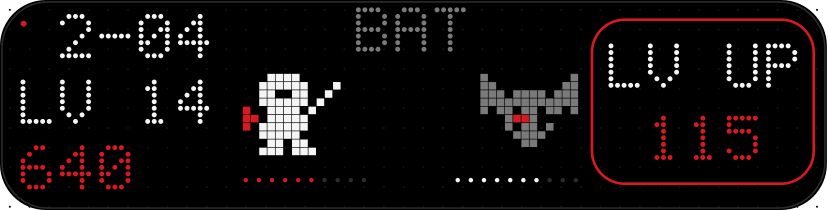

# Taskbar Hero — widget Nothing Phone

Un **idle-RPG en barre**, inspiré de [*TBH: Task Bar Hero*](https://store.steampowered.com/app/3678970/TBH_Task_Bar_Hero/)
(Nugem Studio) — le jeu qui tient dans une fenêtre minuscule dockée à la barre des
tâches Windows. Ici la barre des tâches devient une **bande 4×1 sur l'écran
d'accueil d'un Nothing Phone** : un héros pixel enchaîne les vagues tout seul,
même écran éteint, dans le langage visuel de Nothing OS — noir absolu, matrice de
points façon Ndot, un seul accent rouge.

> Projet hommage, sans affiliation avec Nugem Studio ni Nothing Technology.


## Ce que ça fait

La barre tient tout le jeu en trois zones :

| Zone | Contenu |
| --- | --- |
| Gauche | acte-vague (`7-06`), niveau, or — plus un point rouge « en combat » |
| Centre | le héros face au monstre, une jauge de vie sous chacun, le nom de l'adversaire |
| Droite | le seul bouton : **LV UP** et son prix, cadre rouge dès que c'est payable |

- **Un appui sur la bande** ouvre le donjon plein écran (mêmes points, en plus grand).
- **Un appui sur le bouton** achète un niveau de héros.
- **Redimensionnée en 4×2**, la barre gagne un bandeau de stats : acte courant,
  record, runes et compteur de kills.
- Toutes les 10 vagues, un boss ; le tuer déclenche une vibration et une ligne de
  butin. Si le héros tombe, il repart au début de l'acte — l'or et les niveaux
  restent acquis.
- L'option **AUTO** (dans le donjon) laisse le moteur dépenser l'or tout seul :
  c'est le mode « je le pose et je l'oublie ».

<p align="center">
  
  
</p>

## Le vrai problème technique

Un widget Android n'est pas une fenêtre : il n'a pas de boucle de rendu, son
`updatePeriodMillis` a un plancher de 30 minutes, et il est redessiné à des
moments qu'on ne choisit pas. Un jeu qui « tourne » en barre ne peut donc pas
compter les images.

La simulation est donc une **fonction pure du temps écoulé** :
`IdleEngine.advance(state, now)` rejoue le combat par pas de 250 ms depuis le
dernier tick enregistré. D'où trois propriétés utiles :

- avancer d'un bloc ou en cent morceaux donne **exactement le même état**
  (le tick ne bouge que par multiples entiers) — c'est testé ;
- la progression hors-ligne est gratuite, plafonnée à 12 h de rattrapage ;
- un rafraîchissement raté ne coûte qu'une image périmée, jamais une partie
  fausse.

Le rafraîchissement lui-même passe par une alarme **inexacte** de 30 s qui se
reprogramme (`WidgetTicker`) : jamais de réveil forcé du téléphone pour animer
une jauge de vie.

## Architecture

Trois modules, découpés par ce qui est testable :

```
engine/    Kotlin pur, zéro dépendance Android
  engine/  simulation (IdleEngine, Balance, GameState), police 5x7, sprites, formats
  paint/   Surface (abstraction de dessin) + BarLayout / DungeonLayout
app/       Android : AppWidgetProvider, RemoteViews, SharedPreferences, activité
preview/   Rend les MÊMES layouts en PNG sur JVM (AWT) — revue de design sans émulateur
```

Le point d'articulation est `paint.Surface` : une interface de dessin à quatre
méthodes. La mise en page — chaque point, chaque jauge — vit dans le module pur
et tourne donc à l'identique dans trois contextes :

| Implémentation | Où | Pour quoi |
| --- | --- | --- |
| `AndroidSurface` (Canvas) | `app/` | le téléphone |
| `AwtSurface` (Graphics2D) | `preview/` | les PNG de ce README |
| `RecordingSurface` | tests | vérifier que rien ne dépasse de la barre |

Les images de ce README **sortent du code de production**, pas d'une maquette.

## Tests

```bash
./gradlew :engine:test                          # 33 tests
./gradlew :preview:run --args="docs/preview"    # régénère les PNG
```

Ce qui est couvert, au-delà du « ça ne crashe pas » :

- **Déterminisme** : découper l'avancée en morceaux irréguliers donne le même
  état qu'un seul appel.
- **Bornes de mise en page** : une surface d'enregistrement capture chaque
  primitive et vérifie qu'aucune ne sort du cadre, pour 6 tailles de widget × 7
  états de jeu (dont un run à `LV 240` / `1.4T` d'or, le texte le plus large que
  la barre puisse afficher). C'est le bug qu'un widget ne montre pas : le
  launcher se contente de rogner.
- **Lisibilité** : chaque caractère produit par le HUD a bien un glyphe dans la
  police 5×7 ; les jauges gardent un point allumé à 0,1 % de vie et un point
  éteint à 99,9 %.
- **Équilibrage** : une heure d'idle en AUTO franchit l'acte 1 et tue un boss ;
  l'achat automatique ne passe jamais l'or en négatif ; un héros niveau 1 perd
  bien contre un boss d'acte 6 et recule sans perdre son acte.

## Compiler l'APK

```bash
./gradlew :app:assembleDebug
```

Il faut un SDK Android (`compileSdk 35`, `minSdk 31` — le Nothing Phone (1) est
sorti sous Android 12) et un accès à `dl.google.com` pour le plugin Gradle
Android.

**État de vérification, en toute transparence :** le module `engine` et le
previewer sont compilés et testés (33/33 verts), et les captures ci-dessus en
sortent. Le module `app` n'a **pas** pu être compilé dans l'environnement utilisé
ici : ni SDK Android, ni accès à `dl.google.com`. Son code a été relu ligne à
ligne, mais attendez-vous à devoir corriger un détail au premier
`assembleDebug`.

## Glyph

Les bandes lumineuses passent par le *Glyph Developer Kit* de Nothing
(`com.nothing.ketchum`), qui n'est ni sur Maven Central ni utilisable sans app-id
signé. Le point d'accroche est unique et documenté : `fx/Fx.kt`, `onEvent()`, là
où les boss et les montées de niveau déclenchent déjà l'haptique. Sur tout autre
matériel, le comportement se dégrade proprement en vibration.

## Réglages

Toute la courbe de jeu est dans `engine/.../engine/Balance.kt` — un `data class`
sans état, ce qui permet aux tests de rétrécir les courbes au lieu de simuler des
heures. Pas de constante magique ailleurs.
